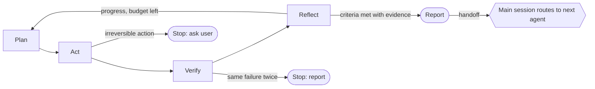

# clawmain

A Claude Code plugin marketplace by [vishnu-77](https://github.com/vishnu-77):
**Groundwork**, a guided setup tool, plus a library of **110+ subagents** in department
plugins. Every agent runs the same evidence-first [loop harness](docs/loop-harness.md).

```
/plugin marketplace add vishnu-77/clawmain
/plugin install groundwork@clawmain
```

Start with `/groundwork` in your repo. It sets up AGENTS.md and CLAUDE.md, teaching a
2-3 word lesson for each choice, and recommends which agent departments fit your project.

## Plugins

| Plugin | What it gives you |
|---|---|
| [groundwork](plugins/groundwork) | Guided setup: verified AGENTS.md, CLAUDE.md, skills, audit |
| [agent-ops](plugins/agent-ops) | Loop planning, verification, reflection, budgets, handoff routing |
| [token-economy](plugins/token-economy) | Spend fewer tokens without losing correctness |
| [risk-reward](plugins/risk-reward) | Score change risk, blast radius, rollback, release gates |
| [explainable-ai](plugins/explainable-ai) | Explain decisions, evidence, confidence, ADRs, model cards |
| [safety](plugins/safety) | Secrets, destructive commands, permissions, prompt injection, PII |
| [quality](plugins/quality) | Test gaps, flaky tests, regression, property and contract tests |
| [code-review](plugins/code-review) | Focused review lenses with `file:line` findings |
| [architecture](plugins/architecture) | Module maps, boundaries, refactors, migrations |
| [devops](plugins/devops) | CI, builds, releases, deploy readiness, incidents |
| [docs](plugins/docs) | READMEs, API docs, onboarding, changelogs, drift detection |
| [ai-engineering](plugins/ai-engineering) | LLM evals, prompts, RAG, guardrails, tool schemas, cost |

Install a department with `/plugin install <name>@clawmain`. The full list is in
[docs/catalog.md](docs/catalog.md) and the handoff graph is in [docs/graph.md](docs/graph.md).

## How every agent works



Every report states **Result, Evidence, Confidence, Risk, Handoff** and a **Why** lesson.
Agents are least-privilege: read-only agents have no edit tools, and none of them take
irreversible actions without approval.

## Use from another marketplace

Any marketplace can list these plugins with a `git-subdir` source. See
[docs/other-marketplaces.md](docs/other-marketplaces.md).

## Maintaining

All department plugins are generated from `catalog/*.toml` by `tools/build.py`.
See [CONTRIBUTING.md](CONTRIBUTING.md).

```
python tools/build.py          # regenerate
python tools/build.py --check  # CI: validate + staleness check
python tools/bump.py <plugin> patch   # then add a CHANGELOG entry; green CI auto-releases
python -m unittest discover -s tests
```
