<!-- Generated by tools/build.py. Edit catalog/*.toml, not this file. -->

# Agent graph

## The loop every agent runs

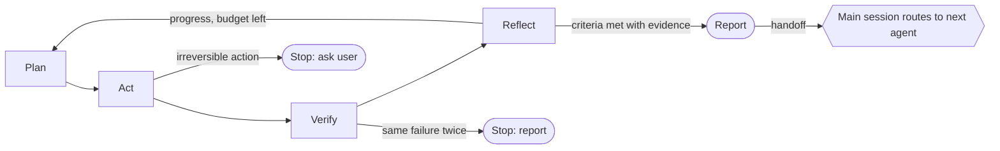

## Departments and cross-department handoffs

Edge labels count handoffs from agents in one department to agents in another.

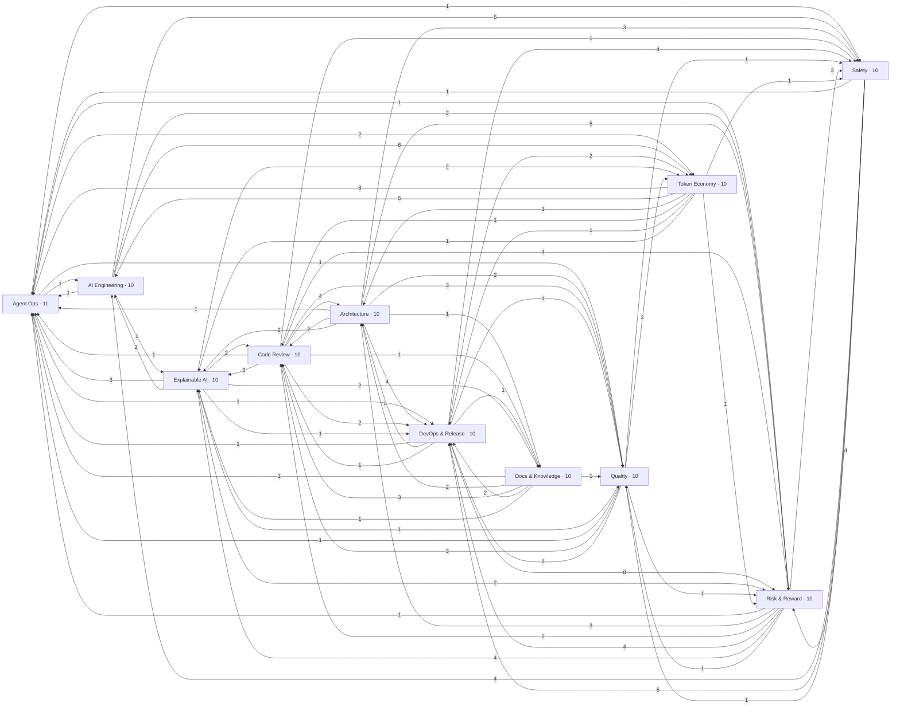

## Per-department handoff graphs

### Agent Ops

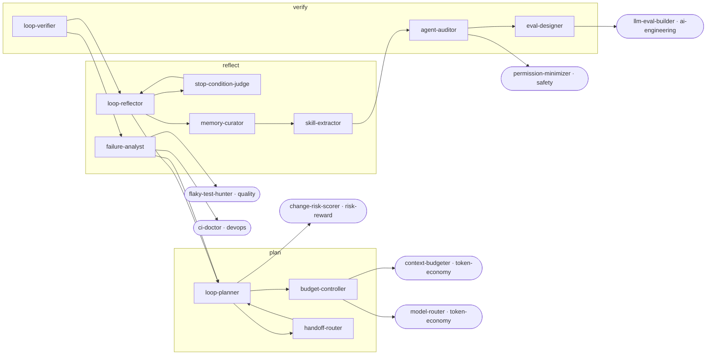

### AI Engineering

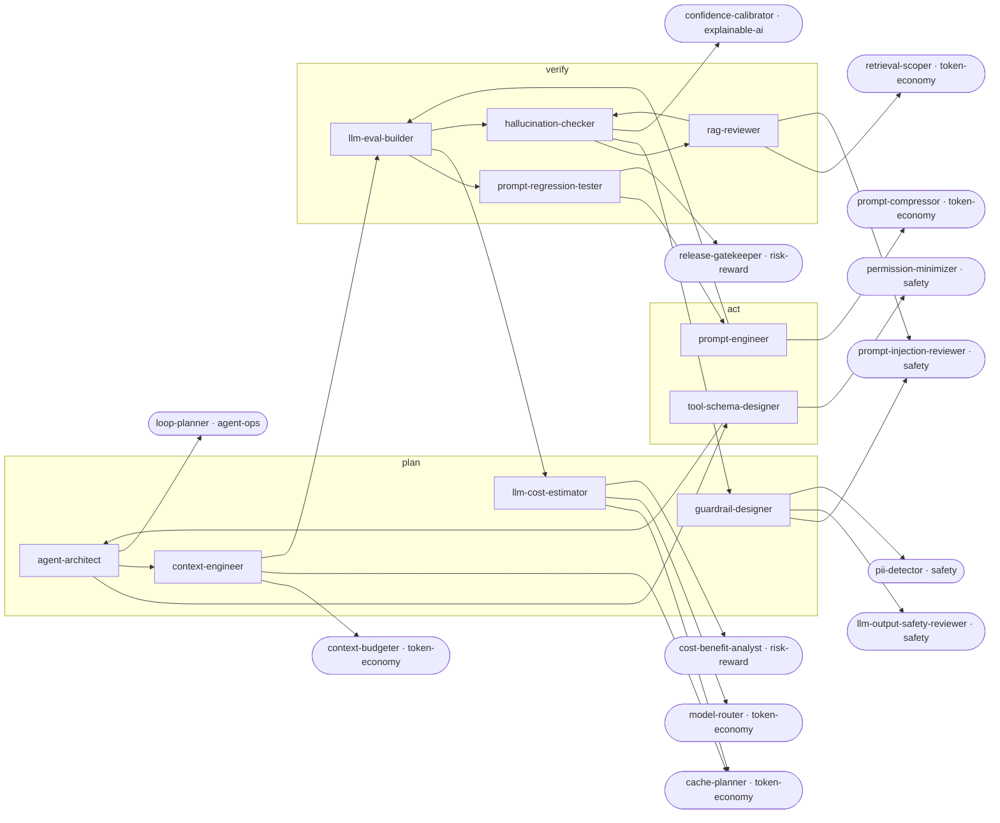

### Architecture

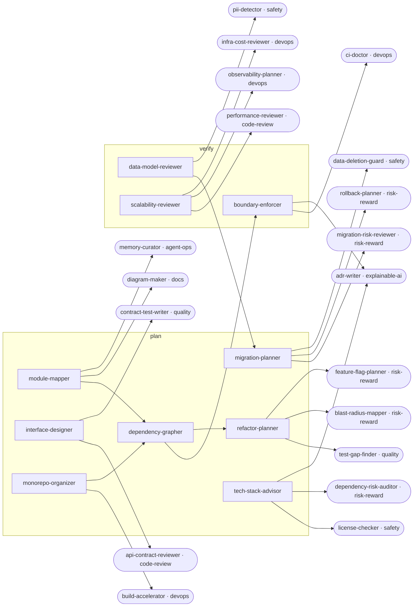

### Code Review

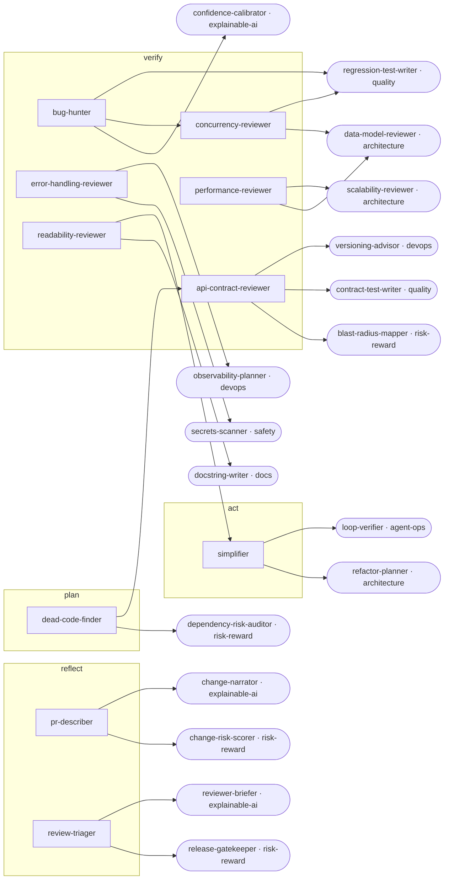

### DevOps & Release

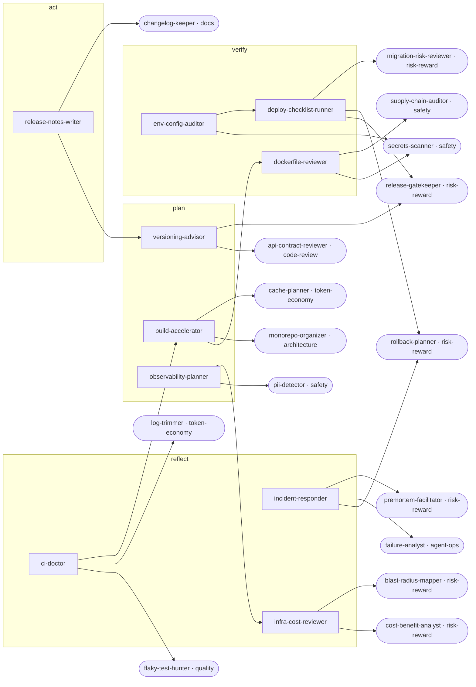

### Docs & Knowledge

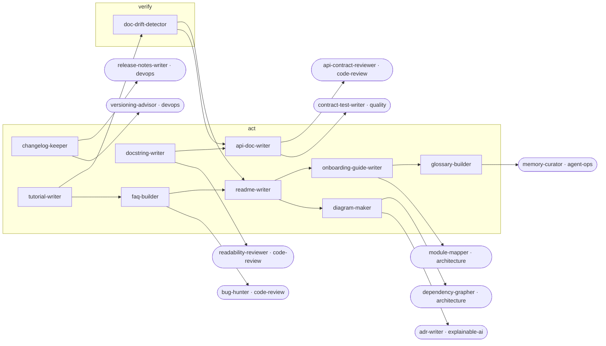

### Explainable AI

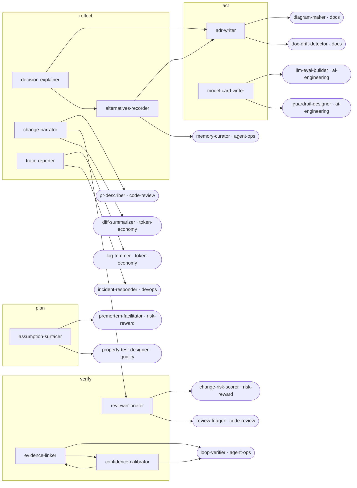

### Quality

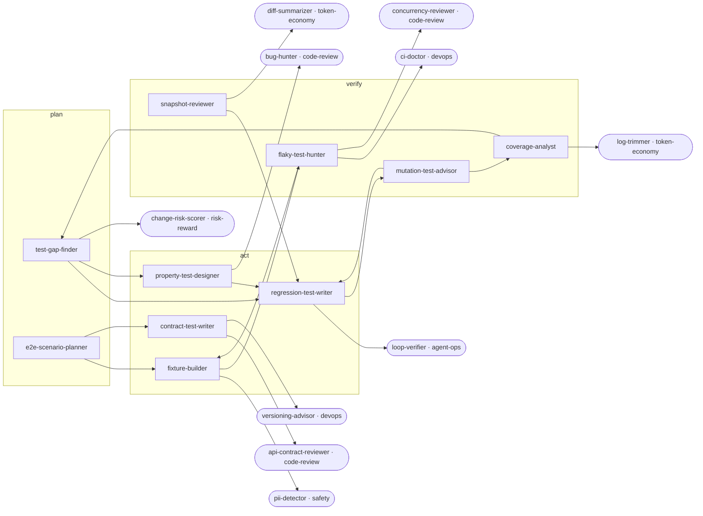

### Risk & Reward

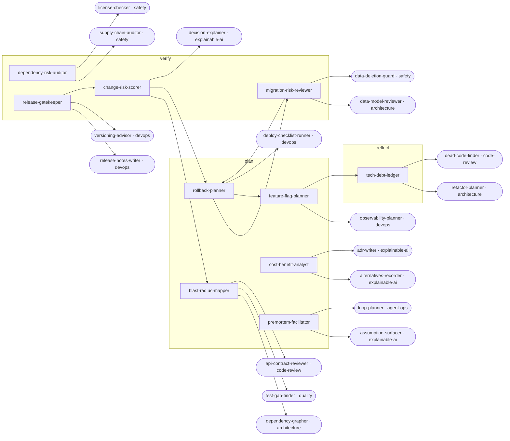

### Safety

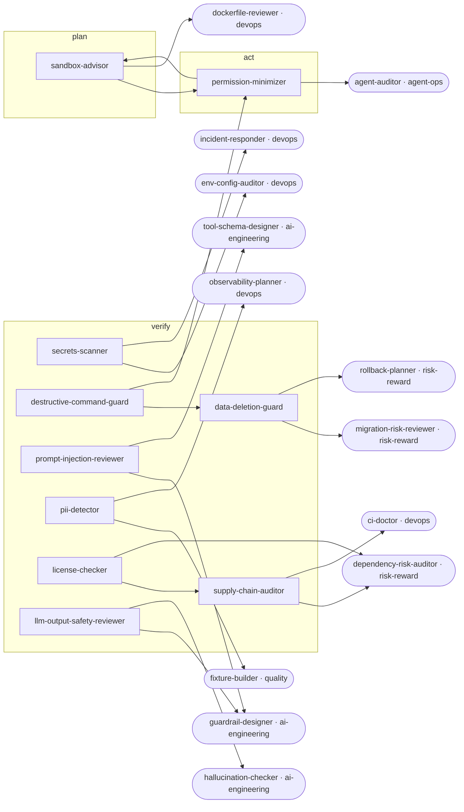

### Token Economy

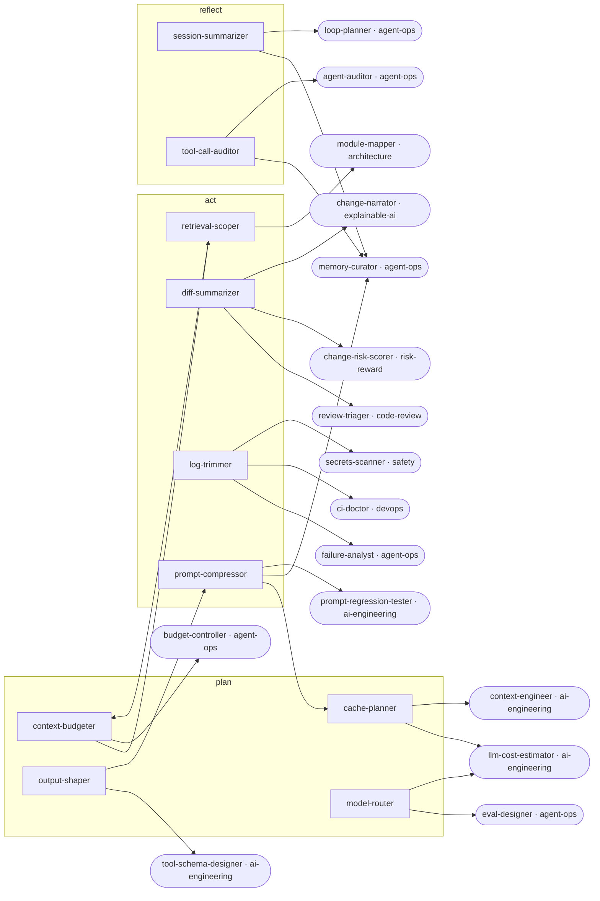
