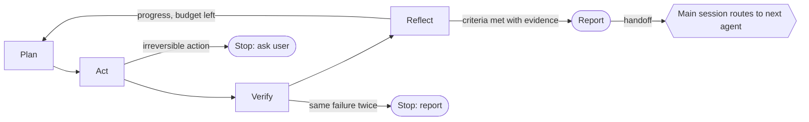

# The clawmain loop harness

Every clawmain agent runs the same loop contract. It is defined once in
[`catalog/_harness.md`](../catalog/_harness.md) and injected into every generated agent
by `tools/build.py`, so changing the harness changes all agents on the next build.

## Why each part exists

| Part | What it does | Why |
|---|---|---|
| Plan with success criteria | Defines done before starting | clear finish line |
| Cheapest evidence first | Grep before Read, ranges before files | spend on purpose |
| Verify with evidence | `file:line` or command output per claim | evidence over claims |
| Reflect, stop after two stalls | Prevents loops that spin | know when stop |
| Budgets | Iteration and token caps per agent | spend on purpose |
| Stop before irreversible steps | Deletes, publishes, pushes, migrations need approval | avoids costly mistakes |
| Report: Confidence + Risk | Every result states confidence and reversibility | explainable by default |
| Handoff field | Names the next agent; the main session routes it | right agent next |

## Loop stages

Each agent declares the stage it mainly serves (`loop_stage` in the catalog):

- **plan**: scope, budget, and route work (e.g. `loop-planner`, `change-risk-scorer`).
- **act**: produce changes or artifacts (e.g. `regression-test-writer`, `readme-writer`).
- **verify**: check work against criteria (e.g. `loop-verifier`, `bug-hunter`, `secrets-scanner`).
- **reflect**: learn and decide what's next (e.g. `loop-reflector`, `failure-analyst`, `memory-curator`).

## Handoffs

Subagents cannot call other subagents. Handoffs are recommendations in the report; the
main Claude Code session (or `handoff-router`) decides whether to invoke the next agent.
The full handoff graph is in [graph.md](graph.md).

## Budgets

Default: 4 iterations, about 40k tokens of reading. An agent can override this in the
catalog with `budget = { max_iterations = N, max_tokens = M }`.
