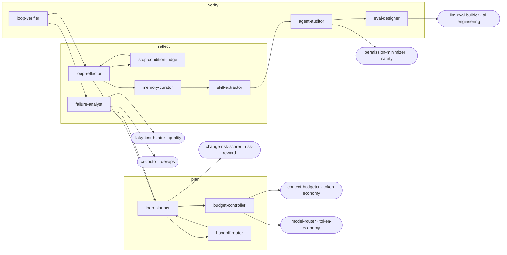

<!-- Generated by tools/build.py from catalog/agent-ops.toml. Edit the catalog, not this file. -->

# Agent Ops

Run agents as a disciplined loop: plan, verify, reflect, budget, route handoffs, and learn from failures.

```
/plugin marketplace add vishnu-77/clawmain
/plugin install agent-ops@clawmain
```

Every agent follows the shared [loop contract](../../docs/loop-harness.md): plan, act, verify, reflect, with budgets, stop conditions and an evidence-backed report.

| Agent | Stage | Mode | Model | Why | Use when |
|---|---|---|---|---|---|
| `loop-planner` | plan | read-only | sonnet | clear finish line | starting a multi-step task, when the goal is fuzzy, or before chaining several agents |
| `loop-verifier` | verify | read-only | sonnet | evidence over claims | an agent claims something is done, fixed, or working |
| `loop-reflector` | reflect | read-only | sonnet | learn each iteration | a loop iteration ends, progress stalls, or before retrying something that failed |
| `budget-controller` | plan | read-only | haiku | spend on purpose | a task may be expensive, a session is getting long, or cost matters |
| `handoff-router` | plan | read-only | haiku | right agent next | a report names a handoff, when several agents could apply, or when chaining agents across departments |
| `stop-condition-judge` | reflect | read-only | haiku | know when stop | unsure whether to keep going or when a loop may be stuck |
| `failure-analyst` | reflect | read-only | sonnet | fix root causes | something failed, an agent got stuck, or the same error keeps coming back |
| `memory-curator` | reflect | writes | sonnet | remember what matters | a lesson was learned, instructions feel outdated, or agent files are growing |
| `skill-extractor` | reflect | writes | sonnet | repeatable workflows | the same multi-step task keeps coming up or a checklist should become reusable |
| `agent-auditor` | verify | read-only | sonnet | agents stay sharp | adding or changing agents or skills, or when an agent misbehaves or triggers at the wrong time |
| `eval-designer` | verify | writes | sonnet | measure, not guess | you need to prove an agent got better or did not regress |

## Handoff graph


