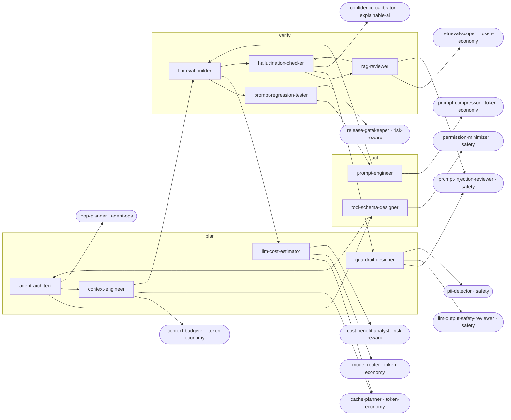

<!-- Generated by tools/build.py from catalog/ai-engineering.toml. Edit the catalog, not this file. -->

# AI Engineering

Build LLM-powered product features that hold up: evals, prompts, RAG, tool schemas, guardrails, cost, and context design.

```
/plugin marketplace add vishnu-77/clawmain
/plugin install ai-engineering@clawmain
```

Every agent follows the shared [loop contract](../../docs/loop-harness.md): plan, act, verify, reflect, with budgets, stop conditions and an evidence-backed report.

| Agent | Stage | Mode | Model | Why | Use when |
|---|---|---|---|---|---|
| `llm-eval-builder` | verify | writes | sonnet | measure model quality | shipping or changing a prompt, model, or RAG pipeline and you need proof it works |
| `prompt-engineer` | act | writes | sonnet | clear instructions win | LLM outputs are inconsistent, wrong format, too long, or the prompt grew by patches |
| `rag-reviewer` | verify | read-only | sonnet | retrieve right context | RAG answers miss known facts, cite wrong sources, or retrieval is slow or costly |
| `hallucination-checker` | verify | read-only | sonnet | grounded answers only | a feature produces confident wrong answers, fake citations, or invented fields |
| `llm-cost-estimator` | plan | read-only | haiku | know unit cost | planning a feature, when the bill spikes, or before choosing a model |
| `tool-schema-designer` | act | writes | sonnet | tools models understand | a model calls the wrong tool, passes bad arguments, or tools overlap |
| `guardrail-designer` | plan | read-only | sonnet | fail safe | an LLM feature faces users, handles untrusted input, or its output drives actions |
| `agent-architect` | plan | read-only | opus | simplest agent works | starting an agent feature, when an agent is unreliable or slow, or before adding more agents |
| `prompt-regression-tester` | verify | read-only | haiku | no silent regressions | a prompt, model version, temperature, or RAG setting changes, or in CI before merging prompt changes |
| `context-engineer` | plan | read-only | sonnet | context is budget | context windows overflow, costs are high, or the model ignores important information |

## Handoff graph


