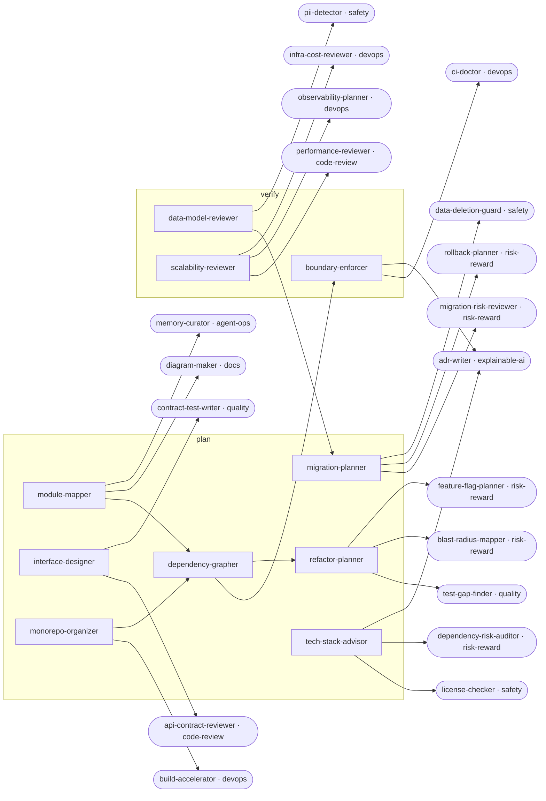

<!-- Generated by tools/build.py from catalog/architecture.toml. Edit the catalog, not this file. -->

# Architecture

Map, protect, and evolve the structure of a codebase: modules, dependencies, boundaries, interfaces, data models, and migrations.

```
/plugin marketplace add vishnu-77/clawmain
/plugin install architecture@clawmain
```

Every agent follows the shared [loop contract](../../docs/loop-harness.md): plan, act, verify, reflect, with budgets, stop conditions and an evidence-backed report.

| Agent | Stage | Mode | Model | Why | Use when |
|---|---|---|---|---|---|
| `module-mapper` | plan | read-only | haiku | faster navigation | onboarding to an unfamiliar repo, before a refactor, or when agents keep getting lost looking for code |
| `dependency-grapher` | plan | read-only | sonnet | see real coupling | coupling is high, builds are slow, or before splitting or moving modules |
| `boundary-enforcer` | verify | writes | sonnet | layers stay clean | layers leak, a clean architecture is intended, or boundary violations keep appearing in review |
| `refactor-planner` | plan | read-only | sonnet | small safe steps | a refactor is too big for one PR, touches many files, or keeps stalling |
| `interface-designer` | plan | read-only | sonnet | hard to misuse | adding a new module or public API, or when an interface is confusing or leaks implementation details |
| `data-model-reviewer` | verify | read-only | sonnet | integrity by design | adding tables or columns, designing a new model, or when queries are slow or data integrity bugs appear |
| `scalability-reviewer` | verify | read-only | sonnet | works at scale | a feature must handle growth, before a launch, or when load tests or production show slowdowns |
| `migration-planner` | plan | read-only | sonnet | zero-downtime changes | renaming columns, moving data, upgrading a major framework version, or switching databases or services |
| `monorepo-organizer` | plan | read-only | sonnet | packages stay independent | a monorepo is slow, messy, or packages depend on each other in tangled ways |
| `tech-stack-advisor` | plan | read-only | sonnet | fit over hype | choosing a new dependency, framework, database, or hosted service |

## Handoff graph


