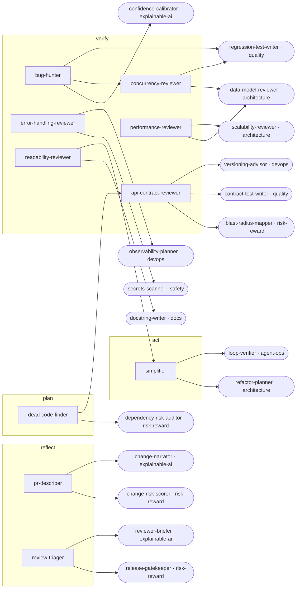

<!-- Generated by tools/build.py from catalog/code-review.toml. Edit the catalog, not this file. -->

# Code Review

Focused review lenses for diffs and PRs: each agent checks one concern and returns file:line findings with severity.

```
/plugin marketplace add vishnu-77/clawmain
/plugin install code-review@clawmain
```

Every agent follows the shared [loop contract](../../docs/loop-harness.md): plan, act, verify, reflect, with budgets, stop conditions and an evidence-backed report.

| Agent | Stage | Mode | Model | Why | Use when |
|---|---|---|---|---|---|
| `bug-hunter` | verify | read-only | sonnet | catch bugs early | reviewing a PR or local diff for bugs before merge |
| `api-contract-reviewer` | verify | read-only | sonnet | keep promises | a PR touches a public API, SDK, schema, or anything other code depends on |
| `concurrency-reviewer` | verify | read-only | opus | races hide well | a diff touches threads, async code, locks, queues, caches, background jobs, or database transactions |
| `error-handling-reviewer` | verify | read-only | sonnet | fail loudly, safely | a PR adds I/O, network calls, parsing, or new error paths |
| `performance-reviewer` | verify | read-only | sonnet | slow is broken | a PR touches hot paths, queries, loops over large data, or a page got slower |
| `readability-reviewer` | verify | read-only | haiku | code is read | a PR is hard to follow or before merging code others will maintain |
| `simplifier` | act | writes | sonnet | less to break | code works but is more complex than it needs to be |
| `dead-code-finder` | plan | read-only | haiku | delete with confidence | cleaning up, before a refactor, or when a codebase feels bloated |
| `pr-describer` | reflect | read-only | haiku | reviewers need context | opening a PR, when a PR description is empty or vague, or when a large change needs a reviewer guide |
| `review-triager` | reflect | read-only | sonnet | fix what matters | several reviewers or agents reviewed the same PR, or a review has too many comments to act on |

## Handoff graph


