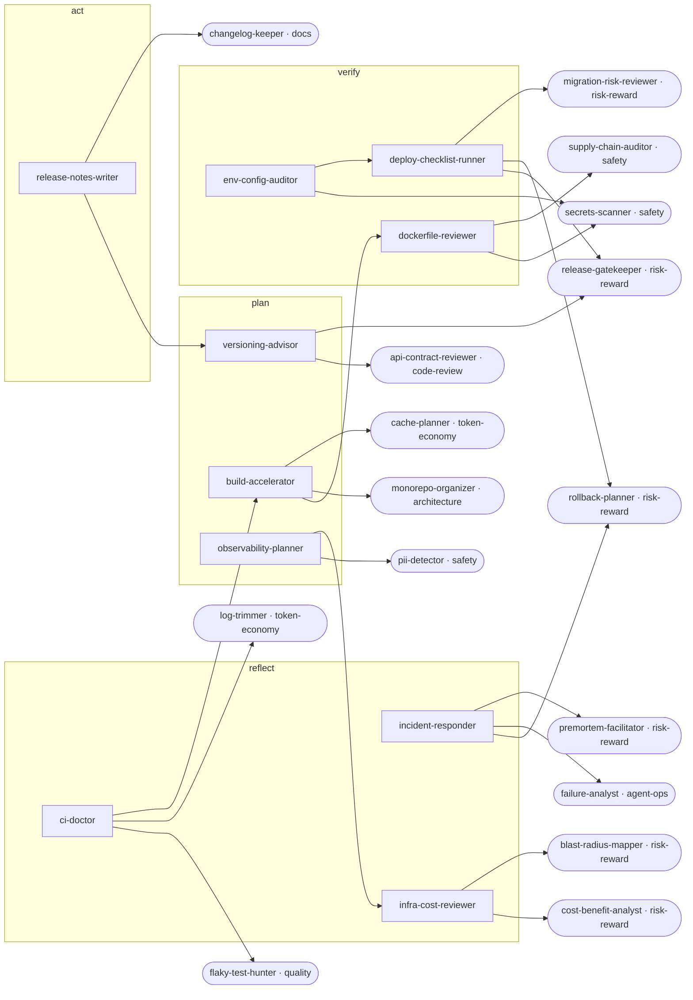

<!-- Generated by tools/build.py from catalog/devops.toml. Edit the catalog, not this file. -->

# DevOps & Release

Keep CI green and fast, ship releases safely, and run production with good configs, containers, observability, and cost control.

```
/plugin marketplace add vishnu-77/clawmain
/plugin install devops@clawmain
```

Every agent follows the shared [loop contract](../../docs/loop-harness.md): plan, act, verify, reflect, with budgets, stop conditions and an evidence-backed report.

| Agent | Stage | Mode | Model | Why | Use when |
|---|---|---|---|---|---|
| `ci-doctor` | reflect | read-only | sonnet | green pipeline | CI is red, passes locally but fails in CI, or a workflow behaves unexpectedly |
| `build-accelerator` | plan | read-only | sonnet | faster feedback loop | builds or CI take too long |
| `release-notes-writer` | act | writes | haiku | users see changes | preparing a release, tagging a version, or publishing a changelog entry |
| `versioning-advisor` | plan | read-only | haiku | honest version numbers | choosing a version number, before tagging, or when version files disagree |
| `dockerfile-reviewer` | verify | read-only | sonnet | small safe images | writing or changing a Dockerfile or when images are large or slow |
| `env-config-auditor` | verify | read-only | haiku | config matches reality | adding config, when an environment behaves differently, or before a deploy |
| `deploy-checklist-runner` | verify | read-only | haiku | ready before deploy | about to deploy or release to production or staging |
| `observability-planner` | plan | read-only | sonnet | see problems early | shipping a new feature or service, when incidents were hard to debug, or when alerts are noisy |
| `incident-responder` | reflect | read-only | sonnet | calm fast triage | production is broken, degraded, or alerting, or right after an incident for a timeline |
| `infra-cost-reviewer` | reflect | read-only | sonnet | spend where valuable | cloud or CI bills grow, before scaling up, or when choosing instance sizes |

## Handoff graph


