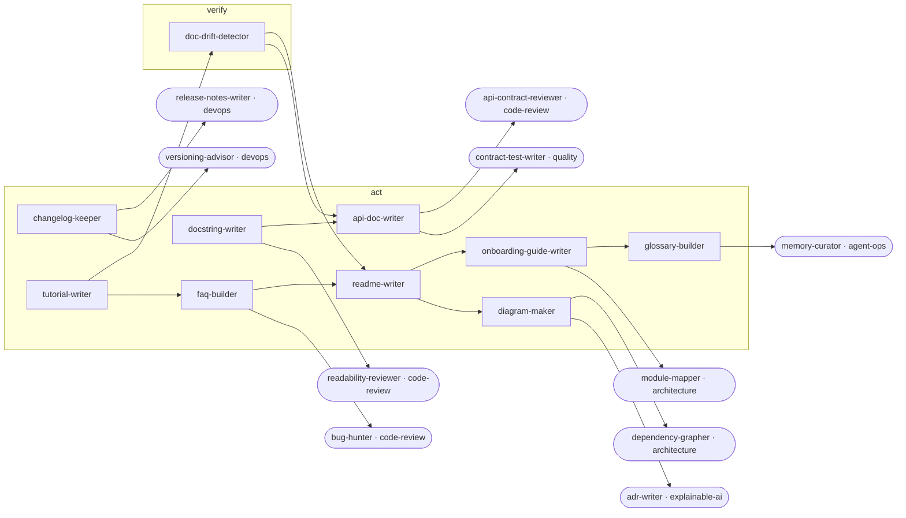

<!-- Generated by tools/build.py from catalog/docs.toml. Edit the catalog, not this file. -->

# Docs & Knowledge

Keep project knowledge accurate and findable: READMEs, API docs, onboarding, changelogs, diagrams, and drift checks.

```
/plugin marketplace add vishnu-77/clawmain
/plugin install docs@clawmain
```

Every agent follows the shared [loop contract](../../docs/loop-harness.md): plan, act, verify, reflect, with budgets, stop conditions and an evidence-backed report.

| Agent | Stage | Mode | Model | Why | Use when |
|---|---|---|---|---|---|
| `readme-writer` | act | writes | sonnet | first impression counts | a README is missing, outdated, too long, or a new user cannot get started from it |
| `api-doc-writer` | act | writes | sonnet | callers need contracts | an API, SDK, or CLI lacks reference docs or the docs no longer match the signatures |
| `onboarding-guide-writer` | act | writes | sonnet | faster first commit | new developers take days to get productive or setup knowledge lives only in people's heads |
| `changelog-keeper` | act | writes | haiku | users see changes | preparing a release, when the changelog is behind the tags, or when commits need a user-facing summary |
| `docstring-writer` | act | writes | haiku | code explains itself | public code lacks docs or docstrings contradict the signatures |
| `glossary-builder` | act | writes | haiku | shared vocabulary | newcomers or agents misread domain language or the same concept has several names |
| `tutorial-writer` | act | writes | sonnet | learn by doing | users know what the project is but not how to accomplish a common goal with it |
| `doc-drift-detector` | verify | read-only | haiku | docs stay true | after a refactor or release, before publishing docs, or when users report docs that do not work |
| `diagram-maker` | act | writes | sonnet | see the system | a system is hard to explain in text, onboarding needs a picture, or a design review needs a current diagram |
| `faq-builder` | act | writes | haiku | answer once | the same questions keep coming up or support load is high |

## Handoff graph


