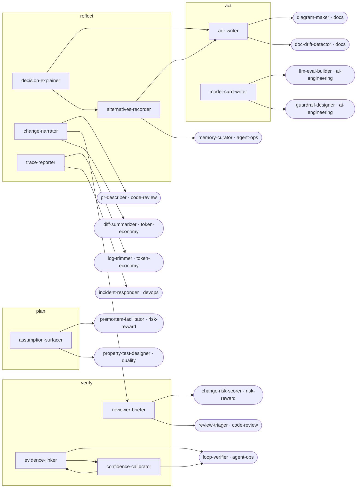

<!-- Generated by tools/build.py from catalog/explainable-ai.toml. Edit the catalog, not this file. -->

# Explainable AI

Make agent work and AI features explainable: why a change was made, what proves it, which assumptions, how confident, and what was rejected.

```
/plugin marketplace add vishnu-77/clawmain
/plugin install explainable-ai@clawmain
```

Every agent follows the shared [loop contract](../../docs/loop-harness.md): plan, act, verify, reflect, with budgets, stop conditions and an evidence-backed report.

| Agent | Stage | Mode | Model | Why | Use when |
|---|---|---|---|---|---|
| `decision-explainer` | reflect | read-only | sonnet | decisions need reasons | someone asks 'why was this done this way?' about a change, function, or config |
| `change-narrator` | reflect | read-only | haiku | reviewers follow intent | handing agent work to a reviewer, writing a PR summary, or explaining a large diff to a non-author |
| `evidence-linker` | verify | read-only | sonnet | claims need proof | a report says 'fixed', 'safe', or 'tested' and you need proof before trusting it |
| `assumption-surfacer` | plan | read-only | sonnet | hidden assumptions break | a plan looks too easy, before a risky change, or when an agent 'just assumed' something |
| `confidence-calibrator` | verify | read-only | haiku | honest certainty | an answer sounds certain without proof, or before acting on an agent's conclusion |
| `trace-reporter` | reflect | read-only | haiku | auditable agent work | you need to audit agent work, explain an incident, or document how a change was produced |
| `alternatives-recorder` | reflect | writes | haiku | stop re-litigating | a design choice was debated, when an agent tried several approaches, or before revisiting an old decision |
| `adr-writer` | act | writes | sonnet | decisions outlive chats | a significant technical decision was made or is being proposed and should be recorded |
| `model-card-writer` | act | writes | sonnet | users understand AI | shipping an ML model or LLM-powered feature, or when users, auditors, or regulators need to understand it |
| `reviewer-briefer` | verify | read-only | sonnet | focus review time | requesting review of an agent's PR or when a reviewer has little time |

## Handoff graph


