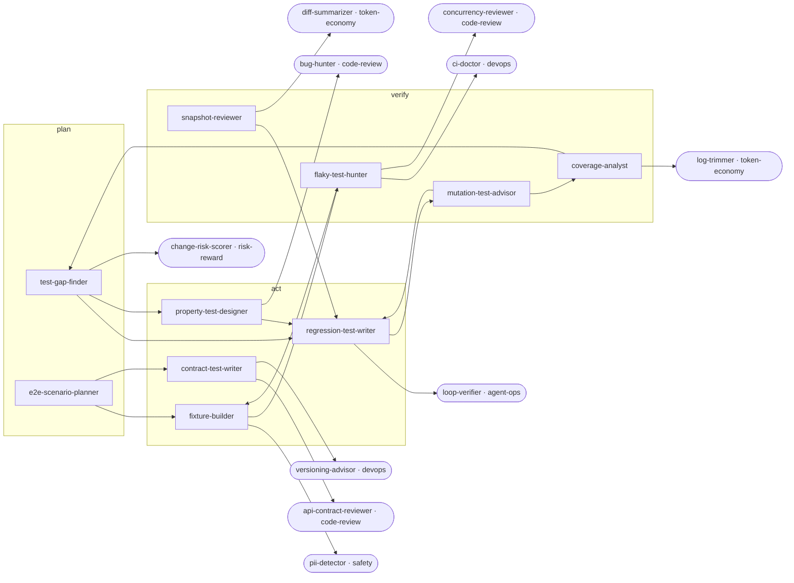

<!-- Generated by tools/build.py from catalog/quality.toml. Edit the catalog, not this file. -->

# Quality

Test strategy and test writing: find gaps, kill flakes, lock regressions, and prove tests actually catch bugs.

```
/plugin marketplace add vishnu-77/clawmain
/plugin install quality@clawmain
```

Every agent follows the shared [loop contract](../../docs/loop-harness.md): plan, act, verify, reflect, with budgets, stop conditions and an evidence-backed report.

| Agent | Stage | Mode | Model | Why | Use when |
|---|---|---|---|---|---|
| `test-gap-finder` | plan | read-only | sonnet | untested means unknown | reviewing a change for missing tests, before a refactor, or when asking what is untested here |
| `flaky-test-hunter` | verify | read-only | sonnet | trust the signal | a test is intermittent, CI fails then passes on retry, or someone says it is flaky |
| `regression-test-writer` | act | writes | sonnet | bugs stay fixed | fixing a bug, after an incident, or when a gap report lists tests to write |
| `property-test-designer` | act | writes | sonnet | edge cases found | code parses, serializes, sorts, computes money or dates, or has many edge-case inputs |
| `mutation-test-advisor` | verify | read-only | sonnet | tests that bite | coverage looks high but bugs still slip through, or to judge test suite strength |
| `coverage-analyst` | verify | read-only | haiku | coverage with meaning | asked about coverage, before setting a coverage gate, or to target test effort |
| `e2e-scenario-planner` | plan | read-only | sonnet | journeys, not pages | adding E2E tests, when E2E suites are slow or brittle, or before a big release |
| `fixture-builder` | act | writes | sonnet | setup without leaks | test setup is duplicated, tests leak state, or new tests need realistic data |
| `snapshot-reviewer` | verify | read-only | haiku | no blind updates | a diff updates snapshots, snapshot tests keep churning, or reviewing a -u run |
| `contract-test-writer` | act | writes | sonnet | catch breaking changes | two services or a client and server share an API, or an API change broke a consumer |

## Handoff graph


