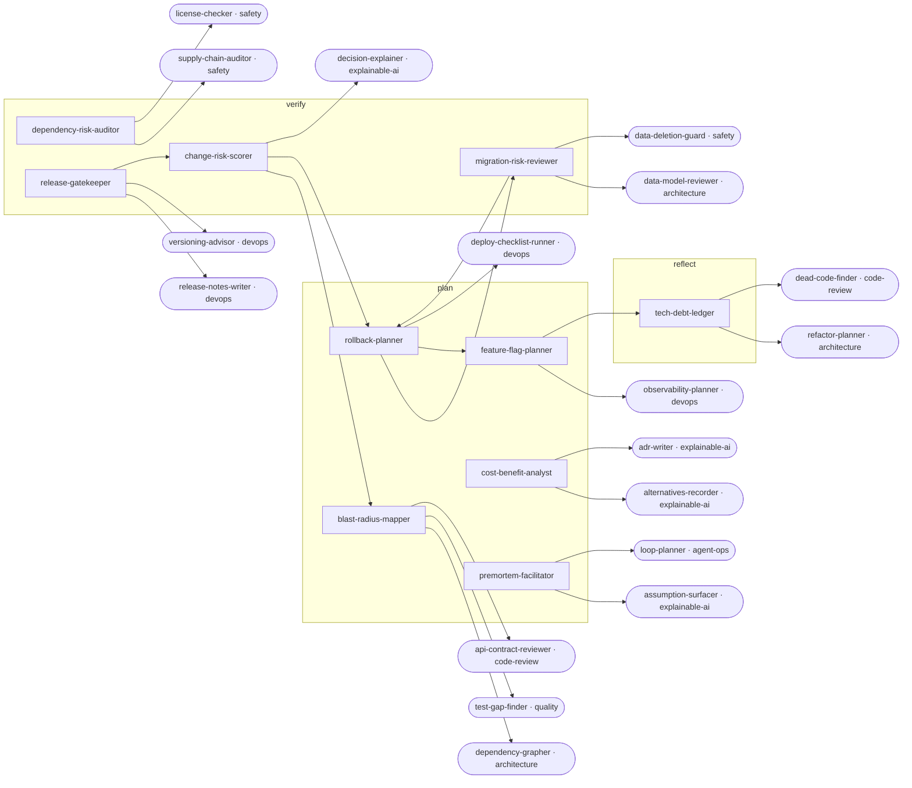

<!-- Generated by tools/build.py from catalog/risk-reward.toml. Edit the catalog, not this file. -->

# Risk & Reward

Weigh the risk of a change against its reward before shipping: explicit risk scores, blast radius, reversibility, rollback plans, and go/no-go gates.

```
/plugin marketplace add vishnu-77/clawmain
/plugin install risk-reward@clawmain
```

Every agent follows the shared [loop contract](../../docs/loop-harness.md): plan, act, verify, reflect, with budgets, stop conditions and an evidence-backed report.

| Agent | Stage | Mode | Model | Why | Use when |
|---|---|---|---|---|---|
| `change-risk-scorer` | verify | read-only | sonnet | risk made visible | deciding whether a PR is safe to merge, how much review it needs, or how to roll it out |
| `blast-radius-mapper` | plan | read-only | sonnet | know what breaks | changing shared code, a public interface, a schema, or config used in many places |
| `rollback-planner` | plan | read-only | sonnet | undo before doing | a change scores high risk, touches data or migrations, or before a major release |
| `dependency-risk-auditor` | verify | read-only | sonnet | dependencies are code | adding a package, bumping versions, or reviewing a lock file change |
| `migration-risk-reviewer` | verify | read-only | sonnet | schemas bite back | a PR adds a migration, changes a schema, or backfills data |
| `feature-flag-planner` | plan | read-only | sonnet | ship small, safely | a change is risky, needs gradual rollout, or should be testable in production safely |
| `cost-benefit-analyst` | plan | read-only | sonnet | worth it, provably | choosing between approaches, deciding whether a refactor or feature is worth it, or prioritizing work |
| `premortem-facilitator` | plan | read-only | sonnet | imagine failure first | preparing a big launch, migration, or rewrite, or when a plan feels overconfident |
| `release-gatekeeper` | verify | read-only | sonnet | go or no-go | about to tag, publish, or deploy a release |
| `tech-debt-ledger` | reflect | writes | haiku | debt has interest | planning refactors, when shortcuts are taken knowingly, or to decide which debt to pay down first |

## Handoff graph


