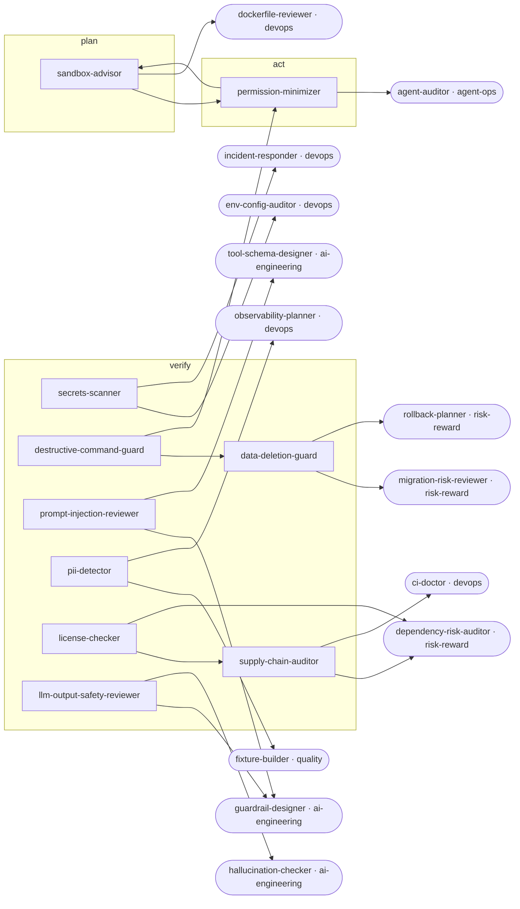

<!-- Generated by tools/build.py from catalog/safety.toml. Edit the catalog, not this file. -->

# Safety

Defensive safety for AI coding agents and what they build: secrets, dangerous commands, least-privilege permissions, prompt injection, PII, licenses, and supply chain.

```
/plugin marketplace add vishnu-77/clawmain
/plugin install safety@clawmain
```

Every agent follows the shared [loop contract](../../docs/loop-harness.md): plan, act, verify, reflect, with budgets, stop conditions and an evidence-backed report.

| Agent | Stage | Mode | Model | Why | Use when |
|---|---|---|---|---|---|
| `secrets-scanner` | verify | read-only | haiku | keys stay private | about to commit or push, after an agent edited config, or when a leak is suspected |
| `destructive-command-guard` | verify | read-only | haiku | avoids costly mistakes | about to run unfamiliar scripts or agent-proposed shell commands |
| `permission-minimizer` | act | writes | sonnet | least privilege | setting up a repo, after permission prompts pile up, or when settings allow too much |
| `prompt-injection-reviewer` | verify | read-only | sonnet | untrusted text | an agent reads external content, when building LLM features with tools, or after odd agent behavior |
| `pii-detector` | verify | read-only | haiku | protect people | handling user data, adding logging or telemetry, or sending data to third-party AI APIs |
| `license-checker` | verify | read-only | haiku | legal clean code | adding dependencies, preparing a release, or when code was copied from elsewhere |
| `supply-chain-auditor` | verify | read-only | sonnet | trust your dependencies | adding a dependency, on a schedule, or when an advisory is published |
| `sandbox-advisor` | plan | read-only | sonnet | contain the blast | an agent will run unattended, run untrusted code, or work with real credentials |
| `data-deletion-guard` | verify | read-only | sonnet | deletes are forever | about to run or merge anything that removes data |
| `llm-output-safety-reviewer` | verify | read-only | sonnet | outputs are untrusted | building or changing features that show or act on LLM output |

## Handoff graph


