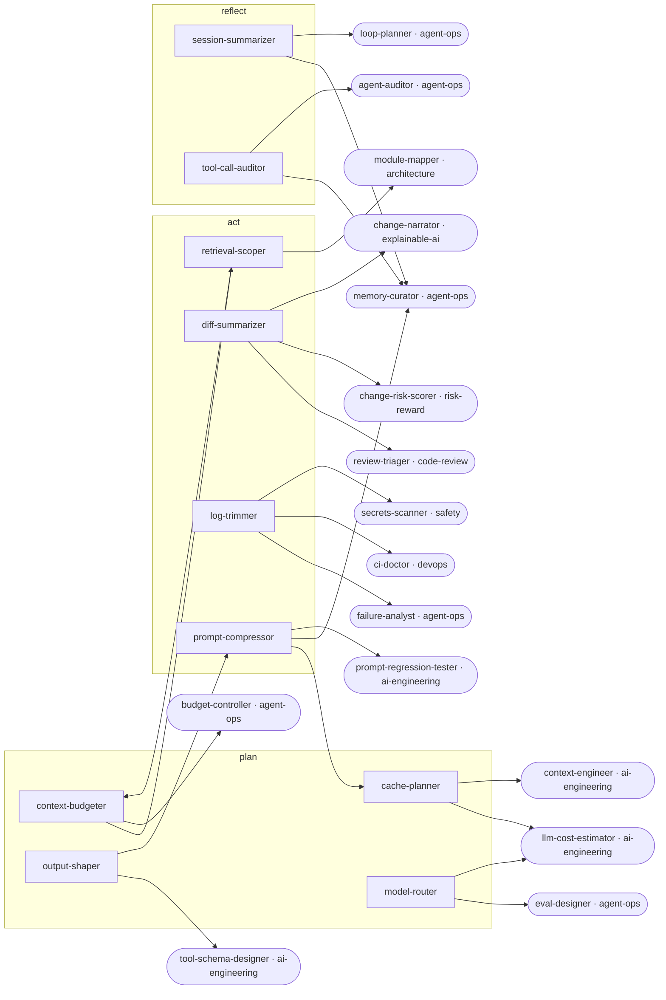

<!-- Generated by tools/build.py from catalog/token-economy.toml. Edit the catalog, not this file. -->

# Token Economy

Spend fewer tokens per task without losing correctness: narrow reads, cache-friendly prompts, compact diffs, logs and outputs, and cheaper models where they are good enough.

```
/plugin marketplace add vishnu-77/clawmain
/plugin install token-economy@clawmain
```

Every agent follows the shared [loop contract](../../docs/loop-harness.md): plan, act, verify, reflect, with budgets, stop conditions and an evidence-backed report.

| Agent | Stage | Mode | Model | Why | Use when |
|---|---|---|---|---|---|
| `context-budgeter` | plan | read-only | haiku | context is budget | a task touches a large codebase, context keeps filling up, or before a broad exploration |
| `prompt-compressor` | act | writes | sonnet | same meaning, fewer | instructions files are bloated, prompts are repetitive, or a prompt is loaded on every call |
| `cache-planner` | plan | read-only | sonnet | reuse paid prefixes | an app or agent sends similar long prompts repeatedly, or cache hit rates are low |
| `diff-summarizer` | act | read-only | haiku | read the signal | a diff is too big to read in full, before a review, or to hand a change to another agent |
| `log-trimmer` | act | read-only | haiku | first error matters | a log is too long to paste, a CI run failed with megabytes of output, or before handing a failure to another agent |
| `model-router` | plan | read-only | haiku | right-size the model | planning agent pipelines, configuring subagent models, or cutting LLM spend |
| `retrieval-scoper` | act | read-only | haiku | search before read | you do not know where code lives, a search returns hundreds of hits, or exploration is burning context |
| `output-shaper` | plan | read-only | haiku | say it shorter | agent reports are long and repetitive, outputs are parsed by code, or output tokens dominate cost |
| `session-summarizer` | reflect | writes | haiku | resume without rereading | context is nearly full, before compaction or /clear, or when handing work to another session |
| `tool-call-auditor` | reflect | read-only | haiku | stop wasted calls | a session felt slow or expensive, or when tuning an agent's instructions |

## Handoff graph


